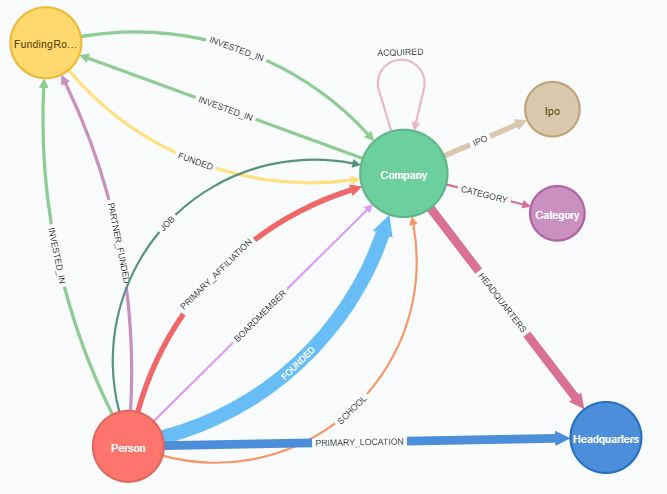

# Venture Capital Analysis Tool
## Description
This repo is designed for users with access to the Crunchbase API to easily download JSON files and upload them to a schema-less graphical database called Neo4j. For more information on Neo4j and its capabilities, click [here](https://neo4j.com/graphacademy/online-training/getting-started-graph-databases-using-neo4j/). 

The repo also provides a template for developing a simple website using [Flask](http://flask.pocoo.org/), [d3.js](https://d3js.org/), and [jQuery](https://jquery.com/)

Below an example of the schema of the database:



## Dependencies
```bash
pip install neo4j
pip install py2neo
```

## Instructions
- instructions for API key 
- instructions for company download
- instructions for people download
- connection to neo4j database
- additional information on bolt 


## To Add:
- Use Cases
- website design


